<!-- _class: lead -->
<!-- _class: frontpage -->
<!-- _paginate: skip -->

# Individual Project Prototype

---

## Overview

Using React and Node.js Express, we can build a ChatGPT Clone.

1. It uses React Frontend and Node.js Express Server.
2. The Express Server uses ChatGPT (OpenAI) API.
3. This project prototype has seven steps.

This app is a prototype of an individual project.

---

### Seven Steps

1. Frontend UI React

2. Express Server with WebSocket

3. Sessions

4. Sending Messages from Server

5. Working with Open AI

6. Deployment

7. Removing the Express Server

---

### Running ChatGPT Clone

Open `5-Working_with_OpenAI_API/client` in the code directory.

#### Start the React Frontend (client)

Build and start React app: use a web browser to access <http://localhost:3000/> if necessary.

```bash
npm install
npm start
```

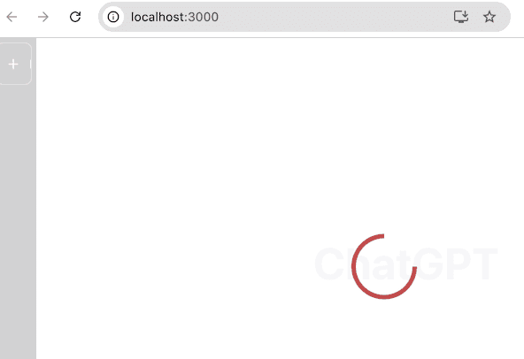

---

#### Start the Node.js Backend (server)

Open `5-Working_with_OpenAI_API/server`, then build and start the server to connect to the client.

```bash
> npm install
> node index.js 
App started listening at port 5000
user connected a87P3Ezy3Hb2cWXmAAAB
```

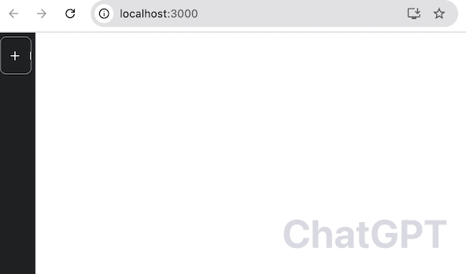

The 5000 is used for the communication port between client and server; change the port if necessary (will be explained later).

---

#### Start a Session

1. Click the "+ New Chat" button, and User Input will pop up.

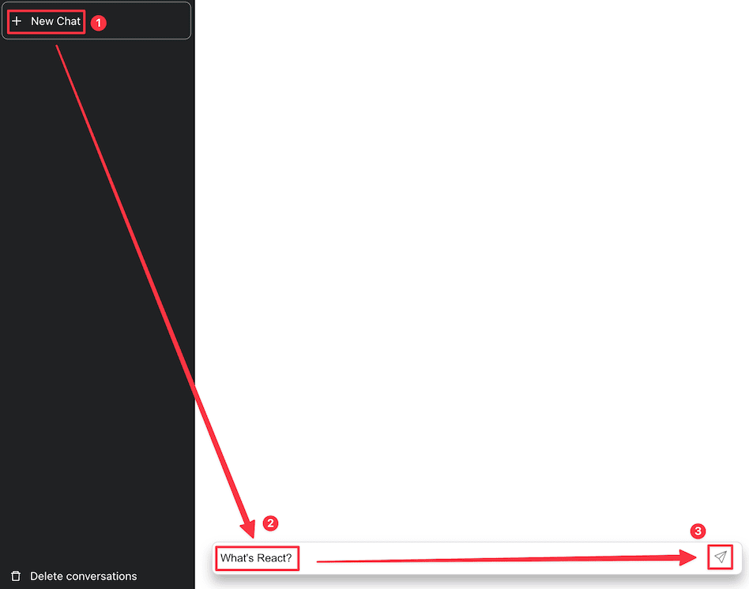

2. Give inputs (any questions to the ChatGPT clone)

- A message will be generated and sent to the server.
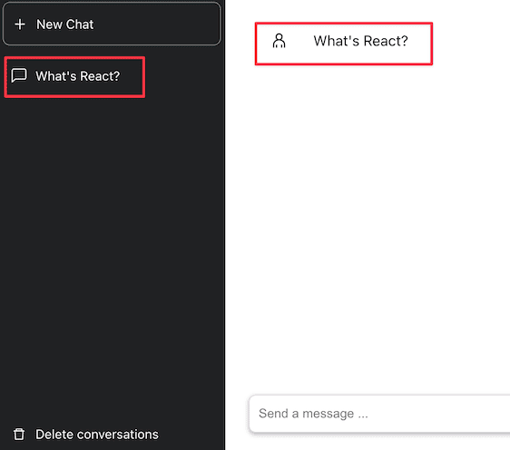

---

3. The server will use the ChatGPT API to ask the question to ChatGPT and get answers from the ChatGPT API.

4. The answer from ChatGPT will be returned to the client and displayed.

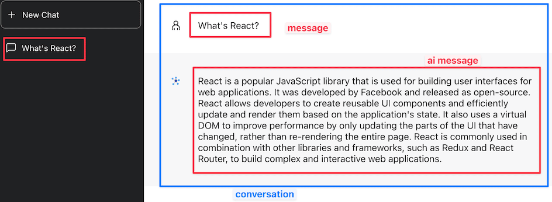

- The two messages (user message and AI message) are one conversation.

---

5. A session can have multiple conversations.

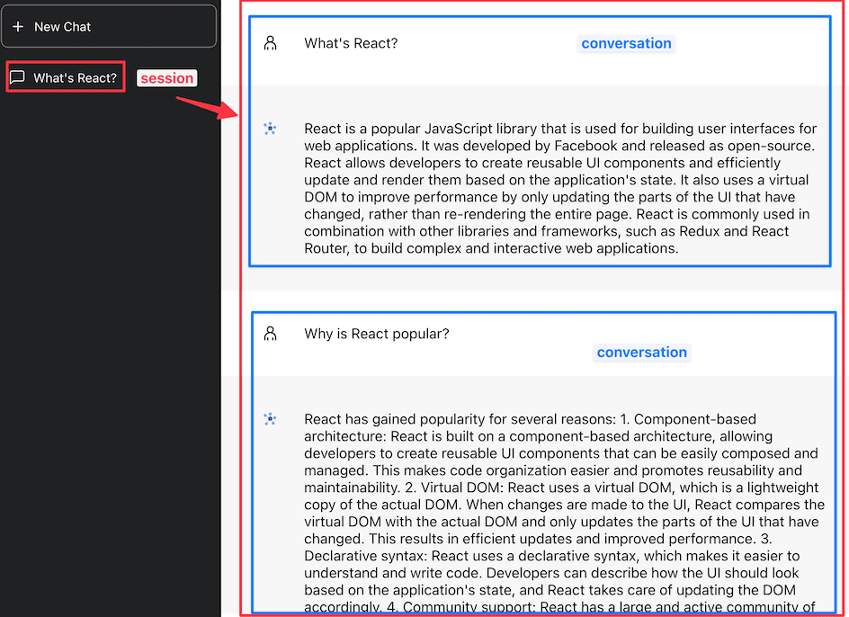

---

#### Start another Session

1. Click the "+ New Chat" button to start a `new session`.

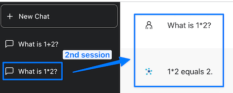

- The following conversations will be a part of the new session.

2. We have multiple sessions in this example.


---

## Data Structures for ChatGPT Clone Application

To manage sessions, messages, and conversations, we need to use multiple data structures (or data models).

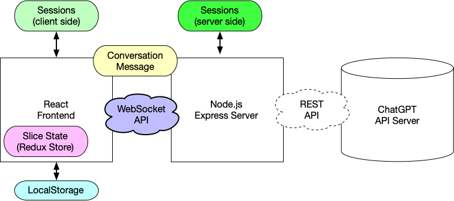

---

### Redux Store (Slice State): Dashboard/dashboardSlice.js

We use Redux Store (Slice State) to store and retrieve states per slice for the client: in other words, we use them for managing states/actions for the React frontend app.

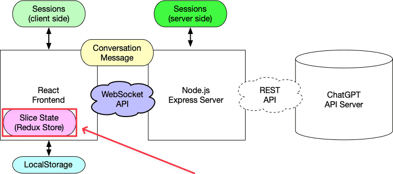

---

#### States

```js
const initialState = {
  sessionEstablished: false,
  conversations: [],
  selectedConversationId: null,
};
```

- sessionEstablished becomes true when

---

#### Reducers (Actions)

Format:

```txt
- reducer name: arguments
  - algorithm (how states are updated)
```

- setSelectedConversationId: conversationId
  - selectedConversationId <- conversationId
- addMessage: message, conversationId
  - conversation = {conversationId, [... message]}
  - conversations.push(conversation)
- setConversations: conversations
  - conversations <- conversations
  - sessionEstablished <- true

---

- setConversationHistory: conversationId, messages
  - conversation = {conversationId, messages}
  - conversation.push(conversation)
- deleteConversations: delete conversations
  - conversations <- []
  - selectedConversationId <- null

---

### WebSocket API

<br/>

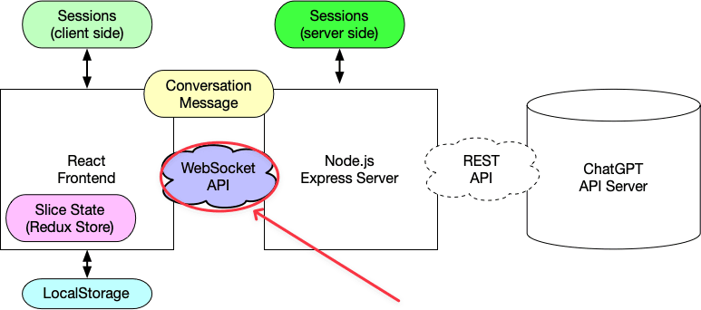

---

#### WebAPI Protocols

- session-history
  - client emits "session-history" API with argument {sessionId}
  - server finds conversations = sessions[sessionId]
  - server emits "session-details" API with argument `session = {sessionId, conversations}`

---

- conversation-message
  - client emits "conversation-message" API with argument {sessionId, message, conversationId}
  - server finds existing conversation in conversations = sessions[sessionId] from conversationId.
  - server invokes ChatGPT API using `message`.
  - server emits "conversation-details" with argument `conversations =`.

---

- conversation-delete
  - client emits "conversation-delete" API with argument {sessionId}
  - server sets `sessions[sessionId] = []`;

- session-details
  - server emits " session-details" API with argument `sessionId`
  - client stores `localStorage.setItem("sessionId", sessionId)`
  - client calls reducer `setConversations(conversations)`

---

- conversation-details
  - server emits " conversation-details" API with argument `conversation`
  - client calls reducer `setConversationHistory(conversation)`

---

### Local Storage (IndexedDB)

We use Local Storage (IndexedDB) to store/retrieve the current session ID.

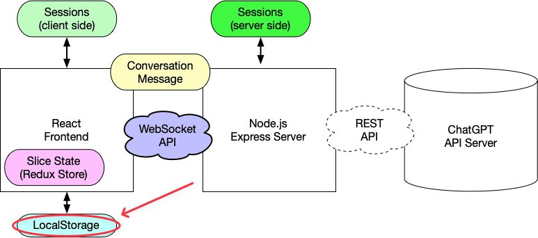

---

To access Local Storage, we should use the Developer mode in our web browser. This is an example using Chrome.

- F12 for Developer mode.
- Choose Application & Local Storage.

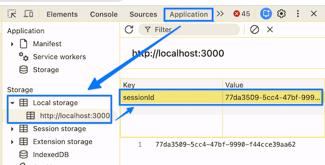

---

We get the current session ID.

```js
localStorage.getItem("sessionId")
```

---

### Conversation Message

#### Message

We use Conversation Message JSON for communication between the client and the server.

- It has the information of
  - current session ID of current session
  - message (that users gave)
  - conversationId of this conversation

```js
const message = {
   aiMessage: true/false,
   content,
   id: uuid(),
   animate: true/false, # optional
 };
```

The `content` is the string from the user (aiMessage: false), or the string from the AI (aiMessage: true).

```js
{
    sessionId: sessionId
    message: message,
    conversationId: conversationId,
}
```

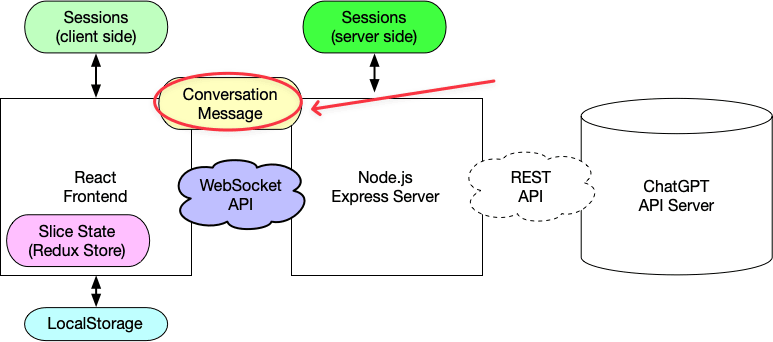

---

```json
const aiMessage = {
    aiMessage: true,
    content: aiMessageContent,
    id: uuid(),
  };
```

---

#### Conversation

```json
{
  id: conversationId,
  messages: [message, aiMessage],
}
```

---

### Session (Client Side)

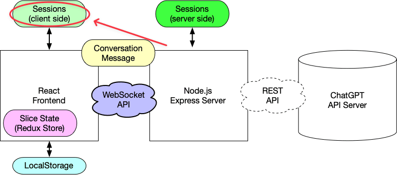

The server should maintain `sessions` to track the communication messages between the server and client.

- Each session has a sessionID
- The sessions dictionary keeps track of sessions using this sessionID

```js
let sessions = {};
sessions[sessionId]
```

---

#### Session (Server Side)

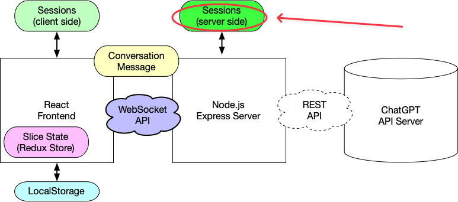

```txt
sessions = {
  sessionId: UID,
  conversations: [conversation]
}
conversation = {
  id: UID,
  messages: [message, aiMessage],
}
message = {
 id: UID,
 content: string,
 aiMessage: false,
}
aiMessage = {
  id: UID
  content: string
  aiMessage: true,
};
```

---

The message will be sent to the server and stored on the server as well.

```txt
user connected 1FIKMq8D3zgY2P3-AAAD
The message came from the client side
{
  message: {
    aiMessage: false,
    content: "What's React?",
    id: '18e931e2-5c90-433f-baca-1e825abc3219',
    animate: false
  },
  conversationId: '94be5564-1ff4-452f-8c41-41c59401a4f7'
}
```
