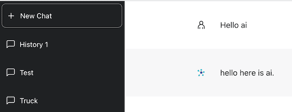

<!-- _class: lead -->
<!-- _class: frontpage -->
<!-- _paginate: skip -->

# Step 1: Frontend UI React

---

## Project Overview

In this project, we build ChatGPT Server step by step.

1. We build an Express server that connects to ChatGPT API.
2. We build React web app that communicates to the Express server through WebSocket.
3. We transform the React web app into Desktop Electron app.
4. Finally, we make a React app that does not use the Express server.

---

### Seven Steps

1. Frontend UI React

2. Express Server with WebSocket

3. Sessions

4. Sending Messages from Server

5. Working with Open AI

6. Deployment

7. Standalone ChatGPT Clone

---

## Client

The first step is to build React Frontend web application: We use npm commands to install packages and run the app.

```bash
npm install
npm start
```

<br/>



We need to start a webbrowser to use this react web application (<http://localhost:3000/>).

---

We start from a Dashboard component.

```js
import Dashboard from "./Dashboard/Dashboard";

function App() {
  return (
    <div className="App">
      <Dashboard />
    </div>
  );
}

export default App;
```

---

Dashboard has Sidebar on the left side, and Chat on the right side.

```js
import React from "react";
import Sidebar from "./Sidebar/Sidebar";
import Chat from "./Chat/Chat";

import "./dashboard.css";

const Dashboard = () => {
  return (
    <div className="dashboard_container">
      <Sidebar />
      <Chat />
    </div>
  );
};

export default Dashboard;
```

---

- .dashboard_container defines the outermost full-screen layout.
  - Creates the outer layout using Flexbox.
  - The default flex-direction: row arranges children horizontally.

```css
.dashboard_container {
    width: 100%;
    height: 100vh;
    display: flex;
}
```

---

```js
.sidebar_container {
    height: 100%;
    display: flex;
    flex-direction: column;
}

.chat_container {
    flex-grow: 1;
    height: 100%;
    display: flex;
    flex-direction: column;
}
```

- `flex-grow: 1;` means “If there’s any leftover space in the flex container, this element should take it up.”

---

- Sidebar (.sidebar_container) sits on the left, Chat (.chat_container) on the right.

```js
    <div className="dashboard_container">
      <Sidebar />
      <Chat />
    </div>
```


---

Sidebar and Chat components have each subcomponents.

```txt
Dashboard/
├── Chat
│   ├── Chat.js
│   ├── Message.js
│   ├── Messages.js
│   └── NewMessageInput.js
├── dashboard.css
├── Dashboard.js
└── Sidebar
    ├── DeleteConversationsButton.js
    ├── ListItem.js
    ├── NewChatButton.js
    └── Sidebar.js
```

---

### Dashboard/Sidebar

### Dashboard/Sidebar/Sidebar.js

Sidebar component has subcomponents: NewChatButton, ListItem, and DeleteConversationsButton.

- These components will be modified to be dynamically added or deleted.

```js
import React from "react";
import NewChatButton from "./NewChatButton";
import ListItem from "./ListItem";
import DeleteConversationsButton from "./DeleteConversationsButton";              

const Sidebar = () => {
  return (
    <div className="sidebar_container">
      <NewChatButton />
      <ListItem title="History 1" />
      <ListItem title="Test" />
      <ListItem title="Truck" />
      <DeleteConversationsButton />
    </div>
  );
};

export default Sidebar;
```

---

### Dashboard/Sidebar/NewChatButton.js

It creates a new chat button that calls `handleChooseNewChat` function when clicked.

- It uses React button "AiOutlinePlus" to show '+'.
- The function is given as a prop.

```js
import React from "react";
import { AiOutlinePlus } from "react-icons/ai";

const NewChatButton = ({ handleSetSelectedChat }) => {
  const handleChooseNewChat = () => {
    handleSetSelectedChat("new");
  };

  return (
    <div className="new_chat_button" onClick={handleChooseNewChat}>
      <div className="new_chat_button_icon">
        <AiOutlinePlus color="white" />
      </div>
      <p className="new_chat_button_text">New Chat</p>                                 
    </div>
  );
};

export default NewChatButton;
```

---

### Dashboard/Sidebar/ListItem.js

ListItem has the same structure: an Icon button from the React and the function (handleSetSelectedChat) to be called when clicked.

- `title, conversationId, handleSetSelectedChat` is given as props.

```js
import React from "react";
import { BsChatLeft } from "react-icons/bs";

const ListItem = (props) => {
  const { title, handleSetSelectedChat, conversationId } = props;

  return (
    <div
      className="list_item"
      onClick={() => handleSetSelectedChat(conversationId)}                                            
    >
      <div className="list_item_icon">
        <BsChatLeft color="white" />
      </div>
      <p className="list_item_text">{title}</p>
    </div>
  );
};

export default ListItem;
```

---

### Dashboard/Sidebar/DeleteConversationsButton.js

```js
import React from "react";
import { AiOutlineDelete } from "react-icons/ai";

const DeleteConversationsButton = () => {
  return (
    <div className="list_item delete_conv_button" onClick={() => {}}>
      <div className="list_item_icon">
        <AiOutlineDelete color="white" />
      </div>
      <p className="list_item_text">Delete conversations</p>
    </div>
  );
};

export default DeleteConversationsButton;
```

Using the CSS, this button is placed at the buttom of the sidebar.

```css
  .delete_conv_button {
    position: absolute;                                       
    bottom: 0;
  }
```  

---

### Dashboard/Chat

### Dashboard/Chat/Chat.js

#### ChatLogo

This component displays ChatGPT Logo.

```js
const ChatLogo = () => {
  return (
    <div className="chat_gpt_logo_container">
      <p className="chat_gpt_logo">ChatGPT</p>                   
    </div>
  );
};
```

```css
.chat_gpt_logo {
    color: rgb(217,217,227);                              
    font-weight: bold;
    font-size: 50px;
}
```

---

#### Chat Component

The Chat component shows the message (Messages) and get the input from users (NewMessageInput).

```js
import React from "react";
import Messages from "./Messages";
import NewMessageInput from "./NewMessageInput";

const Chat = () => {
  return (
    <div className="chat_container">
      <div className="chat_selected_container">              
        <Messages />
        <NewMessageInput />
      </div>
    </div>
  );
};

export default Chat;
```

---

### Dashboard/Chat/Message.js

#### SlowText Component

It displays the `content` with animated effect using
React states and references.

```js
import React, { useState, useRef, useEffect } from "react";

const SlowText = (props) => {
  const { speed, text } = props;
  const [placeholder, setPlaceholder] = useState(text[0]);
  const index = useRef(0);
  useEffect(() => { ... }, [placeholder, speed, text]);

  return <span>{placeholder}</span>;
};
```

---

#### Message Component

This component shows different icons for AI generated message or users' questions.

- Then, it shows the content using SlowText component.

```js
import { GrUser } from "react-icons/gr";
import { FcMindMap } from "react-icons/fc";

const Message = ({ content, aiMessage, animate }) => {
  return (
    <div
      className="message_container"
      style={{ background: aiMessage ? "rgb(247, 247, 248)" : "white" }}
    >
      <div className="message_avatar_container">
        {aiMessage ? <FcMindMap /> : <GrUser />}
      </div>
      <p className="message_text">
        {animate ? <SlowText speed={20} text={content} /> : content}                        
      </p>
    </div>
  );
};

export default Message;
```

---

### Dashboard/Chat/Messages.js

This component displays the Message components.

- For now, it has only two mock messages.
  - The first one is user's question.
  - The second one is AI generatged message.

```js
import React from "react";
import Message from "./Message";

const Messages = () => {
  return (
    <div className="chat_messages_container">
      <Message content="Hello ai" aiMessage={false} />
      <Message animate content="hello here is ai." aiMessage={true} />
    </div>
  );
};

export default Messages;
```
