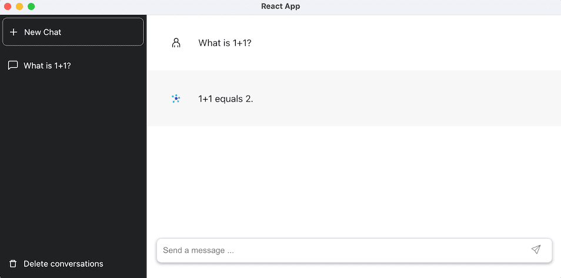

<!-- _class: lead -->
<!-- _class: frontpage -->
<!-- _paginate: skip -->

# Step 6: Deployment

Web Application & Electron

---

## Deployment

When the React and Server app is developed, then we can deploy the app as (1) a web application or (2) Electron desktop app.

1. We build the React app into static HTML/JavaScript files and deploy it using the Node.js Express.
2. We transform the React app into Electron Desktop application.

---

## Web-Application

### Development vs Production

#### Development Mode (npm start in React)

```txt
┌─────────────┐
│   Browser   │
└──────┬──────┘
       │ http://localhost:3000
       │
┌──────▼──────────────────┐
│  React Dev Server       │
│  (webpack-dev-server)   │
└──────┬──────────────────┘
       │ http://localhost:5000
       │
┌──────▼──────────────────┐
│  Express Server         │ <- - -> ChatGPT API Server
└─────────────────────────┘
```

---

#### Production Mode (Express serving build)

```txt
┌─────────────┐
│   Browser   │
└──────┬──────┘
       │ http://localhost:5000
       │
┌──────▼─────────────────┐
│  Express Server        │
│                        │
│  ┌──────────────────┐  │
│  │ Static Files     │  │
│  │ (React Build)    │  │
│  │ - Minified JS    │  │
│  │ - Optimized CSS  │  │
│  │ - Assets         │  │
│  └──────────────────┘  │
│                        │
│  ┌──────────────────┐  │
│  │ API Routes       │  │
│  │ /api/*           │  │
│  └──────────────────┘  │ <- - -> ChatGPT API Server
└────────────────────────┘
```

---

### Compilation of React

We need to create the static files from the React: in the `5-Working_with_OpenAI_API` directory.

```bash
cd ... # 5-Working_with_OpenAI_API
npm run build
```

---

#### File Structure After Build

```txt
client/
└── build/
    ├── index.html  ← Entry point (contains root div)
    ├── static/
    │   ├── css/
    │   │   └── main.{hash}.css ← Styles
    │   └── js/
    │       ├── main.{hash}.js  ← Your React code (minified)
    │       └── runtime.{hash}.js ← React runtime
    ├── favicon.ico
    └── manifest.json
```

---

## Three Steps

### index.js

#### STEP 1: Serve Static React Build Files

We find where the build files are located.

1. Serve all static files (CSS, JS, images, etc.) from the build directory
2. Express will automatically serve files from this directory when requested

```js
const buildPath = path.join(__dirname, '../../../5-Working_with_OpenAI_API/client/build');

app.use(express.static(buildPath));
```

---

#### STEP 2: API Routes

```js
app.get("/api/health", (req, res) => {
  res.json({ status: "Server is working", message: "Hello from API" });
});

// Add more API routes here as needed
// app.get("/api/...", ...)
// app.post("/api/...", ...)
```

### STEP 3: Handle React Router (SPA Routing)

This MUST be the last route: For any route that doesn't match API routes or static files, serve the React app's `index.html`.

- This allows React Router to handle client-side routing

```js
app.get("*", (req, res) => {
  res.sendFile(path.join(buildPath, 'index.html'));
});
```

---

### Run

Be sure to copy the `.env` file in the root directory

```bash
> npm install
> node index.js

Server started at http://localhost:5000
Serving React app from: 5-Working_with_OpenAI_API/client/build
user connected I75jOpPBGV7MyLdyAAAB
```

---

## Electron

### Architecture

```txt
┌─────────────────────────────────────┐
│  Electron (main.js)                 │
│  ┌───────────────────────────────┐  │
│  │  Chromium Browser             │  │
│  │  ┌─────────────────────────┐  │  │
│  │  │  React App (unchanged!) │  │  │
│  │  │  - Components           │  │  │
│  │  │  - Redux                │  │  │
│  │  │  - Socket.io            │  │  │
│  │  └─────────────────────────┘  │  │
│  └───────────────────────────────┘  │
└─────────────────────────────────────┘
       │
┌──────▼──────────────────┐
│  Express Server         │ <- - -> ChatGPT API Server
└─────────────────────────┘
```

---

### Using Vite

We have used CRA (Create React Application) for React, but it has issues with Electron:

1. Directory / build pipeline mismatch with Electron
2. CRA is effectively legacy / in maintenance mode

Instead, we use Vite.

---

#### Converting CRA to Vite

1. The index file is in the root directory.
2. All the React componet with JSX should have extension jsx; the files to include JSX component should be updated also.

---

3. Add `vite.config.js`

The Electron should use relatve paths based on the `base: ./` directory.

```js
import { defineConfig } from 'vite';
import react from '@vitejs/plugin-react';
import path from 'path';

// https://vitejs.dev/config/
export default defineConfig({
  plugins: [react()],
  base: './', // CRITICAL: Use relative paths for Electron
  build: {
    outDir: 'build',
    emptyOutDir: true,
  },
  server: {
    port: 3000,
    strictPort: true,
  },
});
```

---

### Making Electron from React

We need `main.js` and `preload.js` for using React app as Electron app.

### preload.js

Preload script runs before the web page loads: this provides a secure bridge between Electron and your React app.

- Expose protected methods that allow the renderer process to use without exposing the entire Electron API.

```js
const { contextBridge } = require('electron');
contextBridge.exposeInMainWorld('electronAPI', {
  platform: process.platform
});
```

---

### main.js

#### createWindow function

```js
function createWindow() {
  // Create browser window
  const mainWindow = new BrowserWindow({
    width: 1200,
    height: 800,
    webPreferences: {
      nodeIntegration: false,
      contextIsolation: true,
      preload: path.join(__dirname, 'preload.js')
    }
  });
```

---

Check development or production:

1. Check if ELECTRON_IS_DEV environment variable is set
2. Otherwise, check if build folder exists
  
```js
const isDev = process.env.ELECTRON_IS_DEV === '1' || 
  !fs.existsSync(path.join(__dirname, 'build', 'index.html'));
  
  if (isDev) {
    // Development: load from React dev server
    mainWindow.loadURL('http://localhost:3000');
    mainWindow.webContents.openDevTools();
  } else {
    // Production: load from build folder
    mainWindow.loadFile(path.join(__dirname, 'build', 'index.html'));
  }

  // Debug: Log which mode we're in
  console.log('Running in', isDev ? 'DEVELOPMENT' : 'PRODUCTION', 'mode');
}
```

---

```js
// Create window when ready
app.whenReady().then(createWindow);

// Recreate window on macOS when clicked
app.on('activate', () => {
  if (BrowserWindow.getAllWindows().length === 0) {
    createWindow();
  }
});

// Quit when all windows closed (except macOS)
app.on('window-all-closed', () => {
  if (process.platform !== 'darwin') {
    app.quit();
  }
});
```

---

### package.json

Development packages

```json
  "devDependencies": {
    "@vitejs/plugin-react": "^4.0.0",
    "concurrently": "^8.2.2",
    "electron": "^27.0.0",
    "electron-builder": "^24.0.0",
    "vite": "^4.3.9",
    "wait-on": "^7.2.0"
  },
```  

Script commands

```json
  "scripts": {
    "dev": "vite",
    "build": "vite build",
    "preview": "vite preview",
    "electron-dev": "concurrently \"vite\" \"wait-on http://localhost:3000 && ELECTRON_IS_DEV=1 electron .\"",
    "electron-prod": "vite build && NODE_ENV=production electron .",
    "dist": "vite build && electron-builder",
    "clean": "rm -rf dist build node_modules/.vite"
  },
```

---

### Run

```bash
# in the server
npm install
```

---

#### Development

```bash
npm run electron-dev
```

```txt
> chatgpt-electron@0.1.0 electron-dev
> concurrently "vite" "wait-on http://localhost:3000 && ELECTRON_IS_DEV=1 electron ."

[0] 
[0]   VITE v4.5.14  ready in 217 ms
[0] 
[0]   ➜  Local:   http://localhost:3000/
[0]   ➜  Network: use --host to expose
```

---

#### Production

```bash
npm run electron-prod # for development
```

```txt
npm run electron-prod

> chatgpt-electron@0.1.0 electron-prod
> vite build && NODE_ENV=production electron .

vite v4.5.14 building for production...
✓ 161 modules transformed.
build/index.html                   0.46 kB │ gzip:  0.30 kB
build/assets/index-9fd64e55.css    2.96 kB │ gzip:  1.11 kB
build/assets/index-73aacd61.js   229.50 kB │ gzip: 74.01 kB
✓ built in 659ms
Running in PRODUCTION mode
```

---

#### Distribution

```bash
npm run dist # for production
```

```txt
> chatgpt-electron@0.1.0 dist
> vite build && electron-builder

vite v4.5.14 building for production...
✓ 161 modules transformed.
build/index.html                   0.46 kB │ gzip:  0.30 kB
build/assets/index-9fd64e55.css    2.96 kB │ gzip:  1.11 kB
build/assets/index-73aacd61.js   229.50 kB │ gzip: 74.01 kB
✓ built in 682ms
  • electron-builder  version=24.13.3 os=24.6.0
  • loaded configuration  file=package.json ("build" field)
```

---


