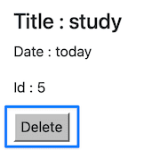

<!-- _class: lead -->
<!-- _class: frontpage -->
<!-- _paginate: skip -->

# JavaScript

AJAX to make a DELETE Request

---

## List API

The list endpoint (API) activates `runListGet` metho.

```js
app.get('/list', function(req, resp){
  runListGet(req, resp);
});

async function runListGet(req, resp) {
    try {
      const posts = db.collection(POSTS);
      const res = await posts.find().toArray();
      const query = { posts: res };
      resp.render('list.ejs', query)
    } catch (e) {
      console.error(e);
    } 
}
```

---

### list.ejs

In this code, we get the all the files in the POSTS collection, and change it to array, and give the array to the argument of `list.ejs`.

<style>
.columns {
  display: flex;
  gap: 2rem;  
  align-items: center;
}
.column.text {
  flex: 8;
}
.column.image {
  flex: 3;
}
</style>

<div class="columns">
  <div class="column image">



  </div>

  <div class="column text">

```html
    <ul class="list-group">
      <% for (var i=0; i < posts.length; i++){ %>
        <li class="list-group-item">
          <h4> Title : <%= posts[i].title %>
          </h4>
          <p> Date : <%= posts[i].date %>
          </p>
          <p> Id : <%= posts[i]._id %>
          </p>
          <button class="delete" 
            data-id="<%= posts[i]._id %>">Delete</button>
        </li>
        <% } %>
    </ul>
```

  </div>

</div>  

When we click the `delete` button, we want to delete the related file in the POSTS collection, and remove the button also.

---

#### HTML `data-*` Attribute Conversion

HTML `data-*` Attribute is converted JavaScript `dataset.*` Property.

- So, the `data-id` is accessed as `dataset.id` in JavaScript.

| HTML Attribute       | JavaScript Property |
|----------------------|---------------------|
| `data-id`            | `dataset.id`        |
| `data-user-name`     | `dataset.userName`  |
| `data-post-id`       | `dataset.postId`    |
| `data-item-type`     | `dataset.itemType`  |
| `data-created-at`    | `dataset.createdAt` |

---

### JavaScript/Fetch (AJAX)

In this example, we would like to use a DELETE request to the /delete endpoint (API), not to use a GET request.

- However, we cannot make DELETE request using a web broswers.
- Instead, we should use JavaScript function to use AJAX.
- We need to use JavaScript fetch (AJAX) to make a DELETE request with the posts ID to be deleted.
- The delete button (with class delete) invokes the AJAX.

---

For the "delete" class, we attach an action to invoke when the button is clicked.

```js

document.addEventListener("click", async (e) => {
  if (!e.target.classList.contains("delete")) return;
```

The `e.target.dataset.id` has the ID to delete.

```js
  const id = e.target.dataset.id;
```

---

Using fetch JavaScript, we access the /delete API of the server using "DELETE" method.

```js
  try {
    const res = await fetch("/delete", {
      method: "DELETE",
      headers: { "Content-Type": "application/json" },
      body: JSON.stringify({ _id: id })
    });

    if (!res.ok) throw new Error("Request failed");
```

---

#### /delete End Point

The JavaScript fetch invokes the DELETE method with `/delete` end point (app.delete('/delete')).

```js
app.delete('/delete', async function(req, resp){ ...})
```

We need to transform the ID in string type to integer type.

```js
req.body._id = parseInt(req.body._id); 
```

---

Then we delete the post with the ID using the deleteOne method.

```js
const posts = db.collection(POSTS)
const res = await posts.deleteOne(req.body); 
```

---

#### Fade out effect

This is JavaScript code to make the fade out effect.

```js
    // Remove parent <li> with fade-out effect
    const li = e.target.closest("li");
    li.style.transition = "opacity 0.4s";
    li.style.opacity = 0;
    setTimeout(() => li.remove(), 400);
```

If finds the closes "li" tag and remove it with style transition and opacity.
