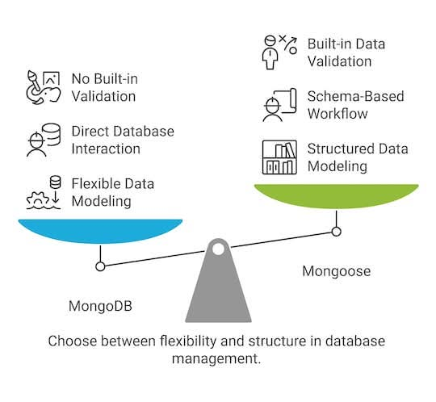

<!-- _class: lead -->
<!-- _class: frontpage -->
<!-- _paginate: skip -->

# Mongoose

Mongoose vs MongoDB

---

## Mongoose: Data Modeling & Schema

Mongoose is an ODM (Object Data Modeling) library for MongoDB.  



Mongoose = Structured, validated, class-like **data modeling** on top of MongoDB’s flexible document model.

---

### MongoDB Problems and Mongoose Solutions

#### Problem 1: No Schema → Data Becomes Inconsistent

MongoDB allows anything not to know the shape of data:

```js
// Same collection…
{ title: "Post A", likes: 10 }
{ title: 123, liked: "yes", tags: ["x"] }
```

Mongoose allows you always know the shape of your data:

```js
const PostSchema = new Schema({
  title: { type: String, required: true },
  likes: { type: Number, default: 0 }
});
```

---

#### Problem 2: Problem 2: No Built-in Validation

MongoDB does not check:

- data types
- required fields
- field lengths
- custom rules

Mongoose Solution: Validation rules in the schema:

```js
title: { type: String, minlength: 3, required: true }
```

Prevents bad data from entering your database.

---

#### Problem 3: No Class-Like Model Layer

With plain MongoDB driver:

- You manually handle logic
- No methods on documents
- No middleware
- No hooks

Mongoose Solution: Models = classes with built-in logic:

```js
PostSchema.methods.isPopular = function () {
  return this.likes > 100;
};
```

You get methods, virtuals, hooks, and lifecycle control.

---

#### Problem 4: Manual Querying & Boilerplate

MongoDB driver requires more raw code to:

- query
- update
- populate relations

Mongoose Solution: Cleaner API

```js
Post.find().populate("author");
```

Built-in helpers eliminate boilerplate.

---

#### Summary

MongoDB’s weaknesses → Mongoose solves them

- ❌ No schema → ✅ Enforced structure
- ❌ No validation → ✅ Built-in rules
- ❌ No model layer → ✅ Classes with methods & hooks
- ❌ Boilerplate querying → ✅ Simple, expressive API

Mongoose gives order and safety on top of MongoDB’s flexibility.

---

## mongoose.connect (No client needed)

Mongoose does **not** require you to create a `MongoClient` like the MongoDB driver.

```js
// MongoDB
const client = new MongoClient(uri);
await client.connect();
const db = client.db("todoapp");
```

Mongoose handles all of this internally:

```js
// Mongoose
await mongoose.connect(uri, {
  dbName: database,
});
const conn = mongoose.connection;
const db = conn.db;
```

---

### Mongoose Connection Model

- mongoose.connect() → internally creates a connection pool using MongoClient
- mongoose.connection.db → native driver’s Db (thin wrapper)
- models → queues through the active connection

You never need to access the raw client.

> Mongoose uses the Singleton Design Pattern automatically

---

### Clsoing Connection

We should use the connection to close.

```js
await mongoose.connect(uri, {dbName: database,});
const conn = mongoose.connection;
conn.close()
```

We need to use client to close for MongoDB.

```js
const client = new MongoClient(uri);
client.close();
```

---

### Example 1: ping.js

```js
const { getConn } = require("./util/db.js");

async function run() {
  let conn = null;
  try {
    // 1. Connect using Mongoose (no client creation)
    conn = await getConn('todoapp');
    // 2. Ping the database through Mongoose's connection
    await conn.db.command({ ping: 1 }); // we use db.command

    console.log("Pinged your deployment. Connected to MongoDB with Mongoose!");
  } catch (err) {
    console.error(err);
  } finally {
    // 3. Close Mongoose connection
    await conn.close();
  }
}

run().catch(console.error);
```

---

## Models

Instead of using collection directly, we use models with a schema:

```js
// models/Post.js
// models/Counter.js
const mongoose = require("mongoose");

const studentSchema = new mongoose.Schema({
  name: String,
  age: Number,
  major: String,
});

module.exports = mongoose.model("Student", studentSchema);
```

---

### No need to Connection

In this example, when we have the connection, we can use the model, we can access MongoDB information; you never need to manually access:

- db
- collection
- client
- native driver

```js
const Student = require("./models/student");   // <-- using the exported model
const { getConn } = require("./util/db.js");

conn = await getConn("nku_demo");
await Student.create({
  name: "Jim",
  age: 22,
  major: "ASE",
});
```

---

### The Magic of exported model

When we export model:

```js
module.exports = mongoose.model("Student", studentSchema);
```

This call does two things:

```js
// 1. Registration
mongoose.models["Student"] = theModelObject
// Return
return new Model("Student", studentSchema)
```

---

As a result, with this code:

```js
const Student = require("./models/student");
```

We can use the following in the Student object:

- create()
- find()
- findById()
- updateOne()
- collection
- hooks
- schema metadata
