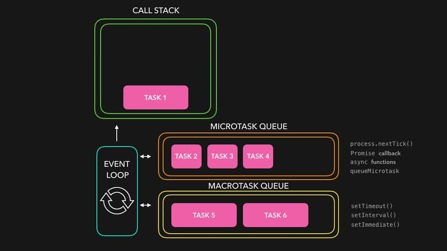

<!-- _class: lead -->
<!-- _class: frontpage -->
<!-- _paginate: skip -->

# Async / Await - The Idea

---

## async/await

Imagine you ask Mom for cookies.

You **wait** while they bake. You don’t stand still forever — you can do other things!

That’s what **async/await** is in JavaScript:

- **async** = “This function can wait.”
- **await** = “Pause here until it’s ready.”

---

## First Example: a tiny magic timer

We’ll use a **sleep** helper to pretend time is passing.

```js
// Magic timer: waits N milliseconds, then continues.
function sleep(ms) {
  return new Promise(resolve => setTimeout(resolve, ms));
}
```

You don’t need to understand the detailed inside yet.
Just know: await sleep(1000) means “wait 1 second”.

- A Promise represents a value that will be available later it’s a “promise” that something will finish eventually.
- When you return a Promise, you let the caller decide what to do when it finishes (using .then() or `await`).

---

### Step 1: The tiniest async function

If the function has `await`, it should be decorated as `async`.

```js
async function demo() {
  console.log('Start');
  await sleep(1000);   // wait 1 second
  console.log('Hello after 1s');
  console.log('End');
}
demo();
```

What happens (in order):

 1. Print “Start”
 2. Wait for 1 second
 3. Print “Hello after 1s”
 4. Print “End”

---

### Step 2: Doing things one-by-one (sequential)

```js
async function oneByOne() {
  console.log('A');
  await sleep(1000);   // wait 1s
  console.log('B');
  await sleep(1000);   // wait 1s
  console.log('C');
}
oneByOne();
// Time ≈ 2 seconds total (1s + 1s)
```

Idea:
Each await pauses until done, then moves to the next line.

---

### Step 3: Start two things together (still using await)

We can start two tasks first, then await them later.

```js
async function together() {
  // Start both timers at the same time
  const t1 = sleep(1000); // starts now
  const t2 = sleep(2000); // starts now

  console.log('Both started!');
  await t1;               // wait for the 1s one
  await t2;               // then wait for the 2s one
  console.log('Both finished!');
}
together();
// Time ≈ 2 seconds total (the slower one)
```

---

### When to use which?

- Sequential (one-by-one):
When B depends on A’s result.
- Parallel (together):
When A and B are independent. Start both, then await them.

---

### Common Misunderstanding

1. Thinking await makes it “faster.”

- It just makes waiting easier to read.

2. Starting tasks after awaiting.

- If you want parallel, start first, then await.

3. Forgetting async on the function.

- You can only use await inside an async function.

---

### Mini practice

1. What prints first?

```js
async function q1() {
  console.log('Hi');
  await sleep(500);
  console.log('There');
}
q1();
console.log('Goodbye');
```

```txt
'Hi`
'Goodbye' <- There is no wait, so other functions can run
(0.5 sec wait)
'There' <- Come back
```

---

2. What prints first?

```js
async function q1() {
  console.log('Hi');
  await sleep(500);
  console.log('There');
}
await q1();
console.log('Goodbye');
```

```txt
'Hi'
(0.5 sec)
'There'
'Goodybe' <- executes only after the q1()
```

---

3. How long does this take?

```js
async function q2() {
  const a = sleep(1000);
  const b = sleep(1000);
  await a;
  await b;
}
q2();
```

```txt
a starts (and sleeps) 
b starts (and sleeps)
a & b waits for 1 sec each
```

About 1 second (started both, then awaited both).

---

 4. Sequential or parallel?

```js
async function q3() {
  await sleep(1000);
  await sleep(1000);
}
```

```txt
sleeps 1 sec, and wait for it to return
sleeps another 1 sec
```

So, Sequential

---

## Full mini-demo (copy/paste)

```js
async function demo() {
  console.log('--- Sequential ---');
  console.time('seq');
  await sleep(1000);
  await sleep(1000);
  console.timeEnd('seq'); // ~2000ms

  console.log('--- Parallel ---');
  console.time('par');
  const a = sleep(1000);
  const b = sleep(1000);
  await a;
  await b;
  console.timeEnd('par'); // ~1000ms
}
demo();
```

---

Run with:

```txt
> node demo.js
--- Sequential ---
seq: 2.005s
--- Parallel ---
par: 1.002s
```

---

## Promises — What Are They?

Imagine you ask Dad:

> “Can I have ice cream?”

He says:

> “Maybe later!”

That’s a **Promise**: It is something that says:

> “I promise to give you a value (✅ success)  
> or tell you why I can’t (❌ fail) — later!”

---

### What a Promise really is

It has 3 states:

- **Pending**: Still waiting
- **Resolve**: Success!
- **Reject**: Failed

---

#### Example: Getting Ice Cream after 1 sec

```js
const iceCream = new Promise((resolve, reject) => {
  setTimeout(() => {
    resolve('Here is your ice cream!');
  }, 1000);
});
```

What’s happening:

- Dad starts making ice cream.
- After 1 second, he says “Done!”
- resolve() means success.

---

#### How to know when it’s done?

We can ask with `.then()` — it means “when ready, do this.”

```js
iceCream.then(message => {
  console.log(message);
});
```

After 1 second the argument of resolve function will be returned:

> Here is your ice cream!

---

#### What if something goes wrong?

```js
const iceCream = new Promise((resolve, reject) => {
  setTimeout(() => {
    reject('The freezer broke!');
  }, 1000);
});

iceCream
  .then(msg => console.log(msg))
  .catch(err => console.log(err));
```

Output after 1s:

> The freezer broke!

---

### Promise Chain

You can use many .then() in a row, like stacking Lego blocks!

```js
function makeDough() {
  return new Promise((resolve) => {
    console.log("Mixing flour, sugar, and butter...");
    setTimeout(() => resolve("dough"), 1000);
  });
}

function bakeCookies(dough) {
  return new Promise((resolve) => {
    console.log(`Baking cookies with ${dough}...`);
    setTimeout(() => resolve("cookies"), 1000);
  });
}
```

---

```js
function eatCookies(frostedCookies) {
  return new Promise((resolve) => {
    console.log(`Eating ${frostedCookies}!`);
    setTimeout(() => resolve("Yum!"), 500);
  });
}

function cry(error) {
  console.error("Oh no!", error);
}
```

- The `resolve` in the Promise() is the function reference that is called when success.

---

```js
// chain the promises like Lego blocks
> makeDough().then(bakeCookies).then(eatCookies).then((result) => console.log("✅ Finished:", result))
  .catch(cry);

Mixing flour, sugar, and butter...
Baking cookies with dough...
Eating cookies!
✅ Finished: Yum!  
```

- Each .then() waits for the previous step to finish.
- The argument to the then is the function that is executed when resolved, and the argument to the function is the resolved values ("dough", "cookies", ...).
- If one fails, .catch() handles it.

---

> - makeDough() returns Promise whose argument is a lambda function.
> - When successful (resolved), it returns the value "dough" from resolve("dough").
> - The argument to the makeDough().then() is function reference => bakeCookies.
> - The bakeCookies are invoked with the return value "dough" from the previous resolve.
> - The bakeCookies returns a Promise, and when resolved, the "cookies" will be returned and given to the argument of the next function eatCookies.

---

### Example with async/await

#### Only success

```js
const iceCream = new Promise((resolve, reject) => {
  // You can only call one of these — not both!
  resolve("Here is your ice cream!");
  // reject("The freezer broke!");
});
async function getIceCream() {
  const value = await iceCream; // waits until the promise resolves
  console.log(value);
}
getIceCream();
```

---

#### Example with both outcomes (random_promise.js)

```js
const iceCream = new Promise((resolve, reject) => {
  const coldEnough = Math.random() > 0.5; // randomly succeed or fail
  if (coldEnough)
    resolve("Here is your ice cream!");
  else
    reject("The freezer broke!");
});

async function getIceCream() {
  try {
    const value = await iceCream; // waits until resolved
    console.log(value); // prints the resolved string
  } catch (error) {
    console.error(error); // handles rejection (error)
  }
}

getIceCream();
```

---

### async / await vs Promise.then

| async/await               | Promise.then           |
|---------------------------|------------------------|
| Looks like normal code    | Uses callbacks         |
| Waits nicely with `await` | Needs `.then()` chains |
| Easier to read            | Older but still useful |

They do the same job — just different styles!

---

## Wrap code in an async IIFE?

In Node.js, top-level await only works inside ES modules:

- when "type": "module" is in your package.json
- or file ends with .mjs

If you use it in a normal .js file, Node shows a warning because it’s not allowed in CommonJS by default.

```txt
smcho@mac async> node demo.js 
(node:19048) [MODULE_TYPELESS_PACKAGE_JSON] Warning: Module type of file:///demo.js 
is not specified and it doesn't parse as CommonJS.
Reparsing as ES module because module syntax was detected. This incurs a performance overhead.
```

---

### The fix: use an async IIFE

An IIFE means Immediately Invoked Function Expression — a function that runs right after it’s defined.

```js
(async function main() {
  const data = await getData();
  console.log(data);
})();
```

- Works everywhere (no top-level warning)
- Lets you use await safely inside a normal .js file
- Keeps code clean and self-contained

---

## Example: File Reading (fileread.js)

We can use Blocking (sync) file reading or Non-Blocking (async) file reading.

```js
const { readFile, readFileSync } = require('fs');

// Blocking!
const txt = readFileSync('./hello.txt', 'utf8');
console.log(txt)


// Non-blocking
readFile('./hello.txt', 'utf8', (err, txt) => {
    console.log(txt)
});
```

---

## The secret behind: The Event Loop

The Event Loop is how JavaScript handles many things at once — even though it runs on a single thread.

### Simple idea

JavaScript can do only one thing at a time, but it’s good at waiting: When something takes time (like setTimeout or a network request) JS says:

> “I’ll come back to it later,”

and moves on to the next task.

---

### Core Pieces

1. **Call Stack**
   - Executes your synchronous code **line by line**.
   - A running task blocks everything else.

2. **Queues**
   - **Microtask queue**: Promises (`.then/.catch/.finally`), `queueMicrotask`.
   - **Macrotask queue**: `setTimeout`, `setInterval`, I/O, `setImmediate` (Node).
   - ⚠️ *These queues get filled **only after** the async operation (timer, I/O, etc.) finishes.*

---

3. **Event Loop**
   - Repeats:
     1) If the **stack is empty**, take **all** microtasks (drain them in order).
     2) If still empty, take **one** macrotask and push it to the stack.
   - It **does not move tasks** while something is on the stack.

---

### How it works

<!-- https://felixgerschau.com/javascript-event-loop-call-stack/ -->

<style>
.columns {
  display: flex;
  align-items: center;
}
.column.text {
  flex: 5;
}
.column.image {
  flex: 4;
}
</style>

<div class="columns">
  <div class="column image">



  </div>

  <div class="column text">

1. Call Stack: Runs your main code line by line.

2. Callback Queue: Stores tasks (like timers or resolved Promises) waiting to run.

3. Event Loop: Keeps checking: “Is the stack empty? Then I can move the next queued task in!”

  </div>

</div>

---

### Example

```js
console.log('A');
setTimeout(() => console.log('timeout'), 0); // macrotask
Promise.resolve().then(() => console.log('microtask')); // microtask
console.log('Z');
```

Output:

```txt
A
Z
microtask
timeout
```

- Stack runs A → schedules callbacks → runs Z.
- Stack empty → event loop drains microtasks first → then runs one macrotask.

---

### Async File read Example

```js
fs.readFile("data.txt", (err, data) => {
  console.log("File read finished");
});
```

1. fs.readFile starts — Node.js tells the OS: “Please read this file from disk.”

- That operation runs outside JavaScript, handled by the OS and Node’s I/O system.

2. Your call stack clears — since the file is being read asynchronously, JS continues executing other code.

- The event loop keeps running but doesn’t block waiting for I/O.

---

3. When the file is done reading, Node pushes the callback
() => console.log("File read finished") into the callback queue.

4. Event loop waits until the call stack is empty.

- Only then it pulls the callback from the queue and executes it.
