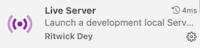
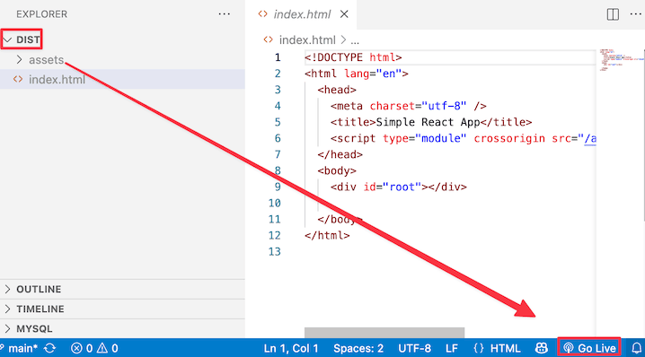

<!-- _class: lead -->
<!-- _class: frontpage -->
<!-- _paginate: skip -->

# Building React Application

---

## Understanding React Compiler and Builder

React is a UI library that helps us build modern front-end applications using components and JSX (a syntax extension that looks like HTML).

However:

- Browsers cannot understand JSX or modern ES6+ syntax directly.
- The React compiler (like Babel, SWC, or esbuild) translates JSX into plain JavaScript:

```js
const element = <h1>Hello</h1>;
// becomes
const element = React.createElement("h1", null, "Hello");
```

---

### Builder (Bundler)

We need the builder or bundler (like Vite, Webpack, or Parcel):

- Combines all your JavaScript, CSS, and assets into a few optimized files.
- Serves them efficiently to the browser.

In short:

- Compiler → Translates JSX into valid JavaScript
- Builder/Bundler → Packages and optimizes everything for the browser

---

### Common React Builders

We will use Webpack/CRA & Vite in this course.

| Builder | Description | Notes |
|----------|--------------|-------|
| **Webpack/CRA** | Classic and flexible bundler | Used in Create React App |
| **Vite** | Next-gen builder using ES modules and esbuild | Super fast startup |
| **Parcel** | Zero-config bundler | Easy for small apps |
| **Next.js** | Full React framework (SSR + routing) | Built on top of Webpack |
| **Rollup** | Library bundler | Often used for React component libraries |

---

## Tools to Make React Apps

### Webpack/CRA (Create React App)

When we use CRA to create React app, it creates a directory as follows.

```bash
npx create-react-app myapp
```

- Automatically sets up React, Babel, and Webpack for you — so you can start coding immediately.

```txt
myapp/
├── public/
│   ├── index.html                                             
│   └── ...
└── src/
    ├── index.js
    └── App.js
```

---

### Vite

Vite exists because modern JavaScript frameworks (like React, Vue, Svelte, etc.) outgrew the old Webpack-based build systems such as Create React App (CRA). 

- It was built to make development faster, simpler, and more efficient.
- Vite uses a modern, fast bundler (ESBuild + Rollup) to start almost instantly.

```bash
npm create vite@latest myapp -- --template react
cd myapp
npm install
npm run dev
```

---

#### Vite React Directory Structure

The React directory structure from Vite is different from CRA.

- index.html sits at the project root, not inside public/.
- Vite relies on ES modules directly, so the entry file is src/main.jsx or src/index.jsx.
- The vite.config.js defines build and dev server options (aliases, plugins, etc.).
- The root package.json manages scripts such as vite, build, and preview.

---

This is the standard minimal setup for a Vite + React app.

```txt
simple-vite/
├── index.html
├── package.json
├── run.sh
├── src
│   ├── App.jsx
│   └── index.jsx
└── vite.config.js
```

---
#### Vite package.json & vite.config.js

```json
{
  "scripts": {
    "start": "vite",
    "build": "vite build"
  },
  "dependencies": {
    "react": "^18.2.0",
    "react-dom": "^18.2.0"
  },
  "devDependencies": {
    "@vitejs/plugin-react": "^4.0.0",                              
    "vite": "^4.3.0"
  }
}
```
```js
import { defineConfig } from 'vite'
import react from '@vitejs/plugin-react'                                    

export default defineConfig({
  plugins: [react()],
})
```

---

### Comparison

<style scoped>
table {
  font-size: 14pt !important;
}
table thead tr {
  background-color: #aad8e6;
}
</style>

| Tool                       | Command                                            | Speed  | Config | Notes                                       |
|----------------------------|----------------------------------------------------|--------|--------|---------------------------------------------|
| **CRA (Create React App)** | `npx create-react-app myapp`                       | Slower | Hidden | Stable but aging (Webpack-based)            |
| **Vite**                   | `npm create vite@latest myapp -- --template react` | Fast   | Simple | Recommended modern setup (ESBuild + Rollup) |

- **CRA**: Great for beginners, but slower and less flexible.  
- **Vite**: Modern, lightweight, and extremely fast — now the preferred tool.  

---

## Building React App

### npx react-scripts

We can use `npx react-scripts`.

```bash
npx react-scripts build
```

When you have react-scripts installed and can run it as scripts.

```json
  "scripts": {
    "start": "react-scripts start",
    "build": "react-scripts build"
  },
```

```bash
npm run build
```

---

It generates static files in the `build` directory.

```txt
build
├── asset-manifest.json
├── index.html
└── static
    └── js
        ├── main.694b8843.js
        ├── main.694b8843.js.LICENSE.txt
        └── main.694b8843.js.map
```

---

### Vite

Vite package.json has the build script command.

```json
  "scripts": {
    "start": "vite",
    "build": "vite build"
  },
```  

So, `npm run build` runs the `vite build` command. 

```bash
npm run build
```
It generates static files in the `dist` directory.

```txt
dist
├── assets
│   └── index-2f9f4b48.js
└── index.html
```

---

## Using Tools

### VSCode for React Web App

1. Install Liver Server Extension



2. Open the build (CRA) or dist (Vite)  directory with VSCode.



---

### Run the server using the build/dist directory

We can install the serve app.

```bash
npm install -g serve
```

Then we can build the React app and run it.

```bash
npm run build # create build directory
server -s build
```

For vite:

```bash
npm run build # create dist directory
server -s dist
```

---

Or we can use `npx`.

```bash
> npx serve -s build # CRA
> npx serve -s dist  # Vite

   ┌───────────────────────────────────────────┐
   │                                           │
   │   Serving!                                │
   │                                           │
   │   - Local:    http://localhost:3000       │
   │   - Network:  http://192.168.86.37:3000   │
   │                                           │
   │   Copied local address to clipboard!      │
   │                                           │
   └───────────────────────────────────────────┘
```   

---

## Minimal React App Structure

We need to have:

1. package.json to install React packages
2. public/index.html for placeholder.
  - ./index.html when using Vite.
3. src/index.js as the starting point.
4. src/App.js as the main application.

```txt
├── package.json
├── public
│   └── index.html
└── src
    ├── App.js
    └── index.js
```

---

### package.json

- depedencies (react/react-dom/react-scripts).
- scripts (start and build).
- browserslist to control which browsers your app targets.

```json
{
  "name": "simple",
  "version": "0.1.0",
  "dependencies": {
    "react": "^19.2.0",
    "react-dom": "^19.2.0",
    "react-scripts": "5.0.1"
  },
  "scripts": {
    "start": "react-scripts start",
    "build": "react-scripts build"
  },
  "browserslist": {
    "production": [">0.2%", "not dead", "not op_mini all"],
    "development": ["last 1 chrome version", "last 1 firefox version", "last 1 safari version"]
  }
}
```

---

For Vite

```json
{
  "name": "simple-vite",
  "version": "1.0.0",
  "description": "Simple React Vite",
  "scripts": {
    "start": "vite",
    "build": "vite build"
  },
  "dependencies": {
    "react": "^18.2.0",
    "react-dom": "^18.2.0"
  },
  "devDependencies": {
    "@vitejs/plugin-react": "^4.0.0",
    "vite": "^4.3.0"
  }
}
```

---

### public/index.html

The HTML template that React injects the app into — usually has a `<div id="root"></div>`.

```html
<!DOCTYPE html>
<html lang="en">
  ...
  <body>
    <div id="root"></div>                                        
  </body>
</html>
```

For Vite:

```html
...
  <body>
    <div id="root"></div>
    <script type="module" src="/src/index.jsx"></script>       
  </body>
</html>  
```  

---

### src/index.js

This is the starting point to find the HTML placeholder, and add React component `App`.

```js
import React from 'react';
import ReactDOM from 'react-dom/client';
import App from './App';

const root = ReactDOM.createRoot(document.getElementById('root'));
root.render(
  <React.StrictMode>
    <App />
  </React.StrictMode>
);
```

---

### src/App.js

This is the highest level React component.

- You can add any React components in this component.

```js
function App() {
  return (
    <div className="App">
      Hello
    </div>
  );
}
export default App;
```

---

### vite.config.js (Only Vite)

```js
import { defineConfig } from 'vite'
import react from '@vitejs/plugin-react'

export default defineConfig({
  plugins: [react()],
})
```