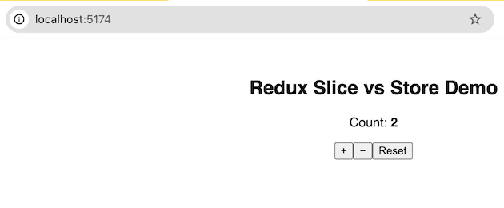
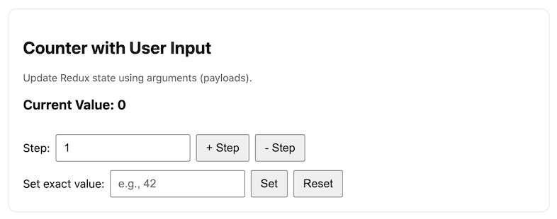
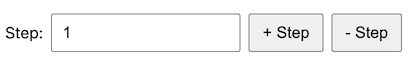

<!-- _class: lead -->
<!-- _class: frontpage -->
<!-- _paginate: skip -->

# Redux Toolkit (RTK)

The Smart Way to Manage Shared States

---

## The Goal - Shared State

We want to create a global variable (shared state) that every component in our React app can read or update — but only in a controlled, predictable way.

- Slice:
  - createSlice() defines how that variable can change (the rules).
- Store:
  - configureStore() creates the place where it lives (the single shared container).

---

### createSlice

> createSlice: makes a small factory for one feature

Think of your React app as a house: Each room is a feature — kitchen, bedroom, bathroom — each has its own stuff and rules.

#### App Part Example “Feature” What it stores (state)

<style scoped>
table {
  font-size: 22pt !important;
}
table thead tr {
  background-color: #aad8e6;
}
</style>

| **App Part** | **Example “Feature”** | **What It Stores (State)** |
|--------------|-----------------------|----------------------------|
| Chat page    | `chatSlice`           | messages, selected user    |
| User login   | `authSlice`           | username, token, status    |
| Todo list    | `todoSlice`           | tasks, filters, progress   |

---

- createSlice **defines** how one part of your app’s state behaves by bundling:.

  - State — the data it manages
  - Reducers — `how` it changes
  - Actions — the commands that `trigger` changes

---

Example:

```js
const chatSlice = createSlice({
  name: "chat",
  initialState: { messages: [] },
  reducers: {
    addMessage: (state, action) => { state.messages.push(action.payload); },
    clearMessages: (state) => { state.messages = []; }
  }
});
```

✅ Output:

- chatSlice.reducer → updates data
- chatSlice.actions → { addMessage(), clearMessages() }

So createSlice builds the logic for one topic/feature (like “chat” or “user”).

---

### configureStore: builds the big factory that runs everything

It combines all your slices’ reducers into one master store.

- It sets up:
  - all reducers (like chat, user, etc.)
  - useful defaults (middleware, DevTools)
  - the single global state container

Example:

```js
const store = configureStore({
  reducer: {
    chat: chatSlice.reducer,
    user: userSlice.reducer
  }
});
```

✅ Output:

- store.dispatch() → sends actions
- store.getState() → reads all data

---

### Why? Separation of Business logic & States

- createSlice → what happens when actions occur (business logic).
- configureStore → where everything lives and runs (states).

Together, they make Redux Toolkit both modular and easy — each slice is like one brain, and the store is the body connecting them all.

---

## Example: count-app1

`code/redux_toolkit/count-app1`

```bash
npm install
npm run dev
```

This example shows how to use slice/store to manage global states.



---

### main

We use React Redux Provider to use store and slice:

```js
import { Provider } from "react-redux";
```

The main Component (CounterApp) uses the store.

```js
import React from "react";
import ReactDOM from "react-dom/client";
import { Provider } from "react-redux";
import { store } from "./store";
import CounterApp from "./CounterApp.jsx";

ReactDOM.createRoot(document.getElementById("root")).render(
  <Provider store={store}>
    <CounterApp />
  </Provider>
);
```

---

### CounterSlice

We create counterSlice:

1. It has one state (value).
2. It has three reducer functions.

```js
import { createSlice } from "@reduxjs/toolkit";

// A slice defines ONE feature's logic (state + reducers + actions)
const counterSlice = createSlice({
  name: "counter",
  initialState: { value: 0 },
  reducers: {
    increment: (state) => { state.value += 1; },
    decrement: (state) => { state.value -= 1; },
    reset: (state) => { state.value = 0; }
  }
});
```

---

- We export three slice actions to `trigger` the update.
- The default export function is the reducer.

```js
// Export auto-generated actions
export const { increment, decrement, reset } = counterSlice.actions;

// Export the reducer for store
export default counterSlice.reducer;
```

---

### store.js

Store combines all the reducers (we have only one in this example).

```js
import { configureStore } from "@reduxjs/toolkit";
import counterReducer from "./counterSlice";

// The store combines ALL slices (features) into one global state
export const store = configureStore({
  reducer: {
    counter: counterReducer
  }
});
```

---

### CounterApp

#### Trigger the Update

We import useSelector and useDispatch:

- We have three actions, increment/decrement/reset.

```js
import { increment, decrement, reset } from "./counterSlice";
```

- dispatch is used to dispatch to `trigger` the action.

```js
import React from "react";
import { useSelector, useDispatch } from "react-redux";

export default function CounterApp() {
  const dispatch = useDispatch();
```

```js
<button onClick={() => dispatch(increment())}>+</button>
```

---

#### Retrieve the States

The count const is used to get the state value.

```js
const counterSlice = createSlice({
  name: "counter",
  initialState: { value: 0 },
```

useSelector() subscribes the component to Redux state: so, when the value and React state count is updated, React redraws UI.

```js
  const count = useSelector((state) => state.counter.value);
```

---

```js
  return (
    <div style={{ fontFamily: "sans-serif", textAlign: "center", marginTop: "3em" }}>
      <h2>Redux Slice vs Store Demo</h2>
      <p>Count: <strong>{count}</strong></p>
      <button onClick={() => dispatch(increment())}>+</button>
      <button onClick={() => dispatch(decrement())}>−</button>
      <button onClick={() => dispatch(reset())}>Reset</button>
    </div>
  );
}
```

---

## Example: count-app2

`code/redux_toolkit/count-app2`



---

### counterSlice

#### States

The same slice with name "counter" and initial value 0.

```js
const counterSlice = createSlice({
  name: "counter",
  initialState: { value: 0 },
```

It is accessed as follows:

```js
// Inside the same createSlice
setValue: (state, action) => {
      const n = Number(action.payload);
      if (!Number.isNaN(n)) state.value = n;
    },
```

```js
const value = useSelector((state) => state.counter.value);
```

---

#### Argument Passing

We can get argument from the user through `action.payload`.

Without argument:

```js
    increment: (state) => { state.value += 1; },
```

With argument:

```js
    setValue: (state, action) => {
      const n = Number(action.payload);
      if (!Number.isNaN(n)) state.value = n;
    },
```

---

The createSlice function: actions (triggers) are generated automatically.

```js
import { createSlice } from "@reduxjs/toolkit";

const counterSlice = createSlice({
  name: "counter",
  initialState: { value: 0 },
  reducers: {
    setValue: (state, action) => {
      const n = Number(action.payload);
      if (!Number.isNaN(n)) state.value = n;
    },
    incrementBy: (state, action) => {
      const n = Number(action.payload) || 0;
      state.value += n;
    },
    decrementBy: (state, action) => {
      const n = Number(action.payload) || 0;
      state.value -= n;
    },
    reset: (state) => { state.value = 0; }
  }
});

export const { setValue, incrementBy, decrementBy, reset } = counterSlice.actions;
export default counterSlice.reducer;
```

---

### CounterApp

We access the four actions from counterSlice:

```js
import React, { useState } from "react";
import { useSelector, useDispatch } from "react-redux";
import { setValue, incrementBy, decrementBy, reset } from "./counterSlice";
```

We use selector for getting the state, and dispatch for
updating the state.

```js
export default function CounterApp() {
  const value = useSelector((s) => s.counter.value);
  const dispatch = useDispatch();
```

---

We create states for React UI.

```js
  const [step, setStep] = useState(1);
  const [direct, setDirect] = useState("");
```

We use dispatch to trigger states (global variables) update using dispatch and action.

```js
  const onInc = () => dispatch(incrementBy(Number(step) || 0));
  const onDec = () => dispatch(decrementBy(Number(step) || 0));
  const onSet = () => dispatch(setValue(direct));
```

---

This is React UI:

```js
  return (
    <div className="card">
      <h2>Counter with User Input</h2>
      <p className="muted">Update Redux state using arguments (payloads).</p>
```

Current value is displayed:

```js
      <h3>Current Value: {value}</h3>
```

---

We get user input using input, and when users give a value, the value is updated using setStep.

```js
  const [step, setStep] = useState(1);
```

User's input is used to update the `step` state.

```js
      <div className="row">
        <label>Step:</label>
        <input
          type="number"
          value={step}
          onChange={(e) => setStep(e.target.value)}
        />
```



---

```js
  const onInc = () => dispatch(incrementBy(Number(step) || 0));
  const onDec = () => dispatch(decrementBy(Number(step) || 0));
  const onSet = () => dispatch(setValue(direct));
```  

```js
<button onClick={onInc}>+ Step</button>
<button onClick={onDec}>- Step</button>
```

1. incrementBy is the action to trigger the update: When you call incrementBy(5), it returns an action object like:

```js
{ type: "counter/incrementBy", payload: 5 }
```

---

```js
dispatch(incrementBy(Number(step) || 0));
```

2. dispatch() tells the Redux store: “Here’s an action — go update the state.

The store looks at the action type ("counter/incrementBy") and runs the matching reducer from your slice.

```js
incrementBy: (state, action) => {
  state.value += action.payload;
}
```

---

```js
const value = useSelector((s) => s.counter.value);
<h3>Current Value: {value}</h3>
```

3. React auto-updates the UI

- useSelector() subscribes the component to Redux state.
- When the state changes, React automatically re-renders the component, showing the new value — no manual refresh or setState needed.

---

Setting value follows the same pattern:

```js
<div className="row">
  <label>Set exact value:</label>
  <input
    type="number"
    value={direct}
    onChange={(e) => setDirect(e.target.value)}
    placeholder="e.g., 42"
  />
  <button onClick={onSet}>Set</button>
  <button onClick={() => dispatch(reset())}>Reset</button>
</div>

```
